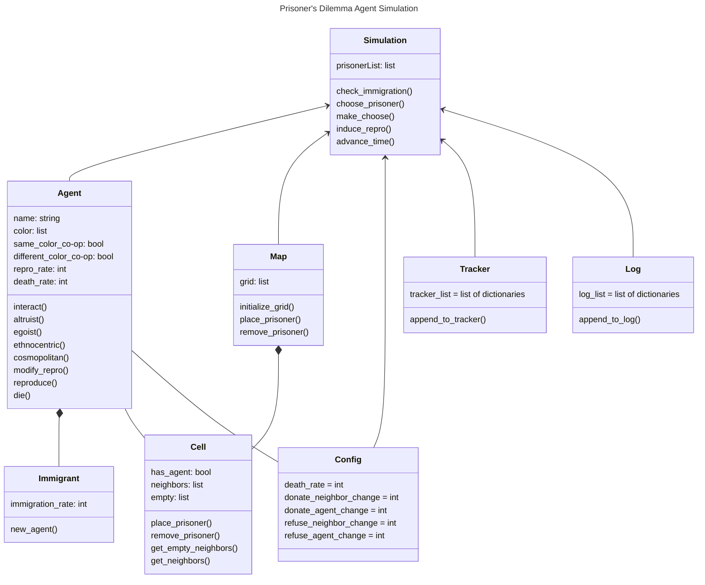

```mermaid
---
title: Prisoner's Dilemma Agent Simulation
---
classDiagram
direction TB

Map *-- Cell
Agent *-- Immigrant
Simulation <-- Agent
Simulation <-- Map
Simulation <-- Config
Simulation <-- Tracker
Simulation <-- Log
Agent -- Cell
Agent -- Config

class Simulation {
    prisonerList: list
    check_immigration()
    choose_prisoner()
    make_choose()
    induce_repro()
    advance_time()
}

class Config {
    death_rate = int
    donate_neighbor_change = int
    donate_agent_change = int
    refuse_neighbor_change = int
    refuse_agent_change = int
}

class Tracker {
    tracker_list = list of dictionaries
    append_to_tracker()
}

class Log {
    log_list = list of dictionaries
    append_to_log()
}

class Agent {
    name: string
    color: list
    same_color_co-op: bool
    different_color_co-op: bool
    repro_rate: int
    death_rate: int
    interact()
    altruist()
    egoist()
    ethnocentric()
    cosmopolitan()
    modify_repro()
    reproduce()
    die()
}

class Immigrant {
    immigration_rate: int
    new_agent()
}

class Map {
    grid: list
    initialize_grid()
    place_prisoner()
    remove_prisoner()
}

class Cell {
    has_agent: bool
    neighbors: list
    empty: list
    place_prisoner()
    remove_prisoner()
    get_empty_neighbors()
    get_neighbors()
}

```    