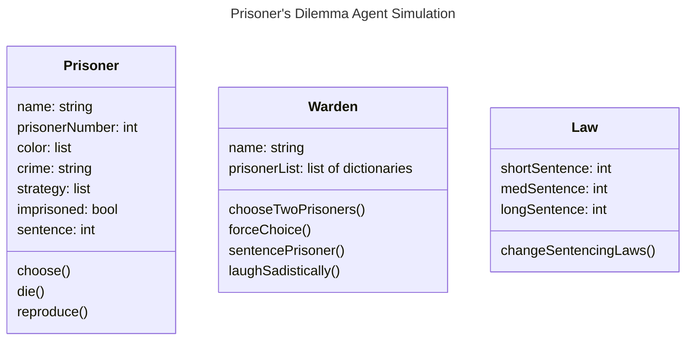

```mermaid
---
title: Prisoner's Dilemma Agent Simulation
---
classDiagram
class Prisoner {
    name: string
    prisonerNumber: int
    color: list
    crime: string
    strategy: list  
    imprisoned: bool
    sentence: int
    choose()
    die()
    reproduce()
}

class Warden {
    name: string
    prisonerList: list of dictionaries
    chooseTwoPrisoners()
    forceChoice()
    sentencePrisoner()
    laughSadistically()

}

class Law {
    shortSentence: int
    medSentence: int
    longSentence: int
    changeSentencingLaws()
}
```    